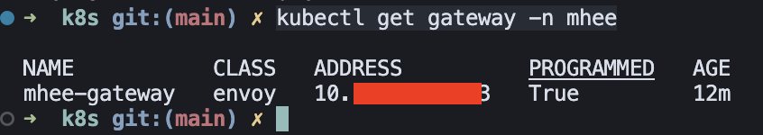

## kubectl 명령어 정리

### 기본 조회
- 클러스터 정보: `kubectl cluster-info`
- 노드 목록: `kubectl get nodes -o wide`
- 네임스페이스 목록: `kubectl get ns`
- 리소스 목록: `kubectl get all -n <namespace>`
- 리소스 상세: `kubectl describe <resource> <name> -n <namespace>`

### 파드/디플로이먼트/서비스
- 파드 조회: `kubectl get pods -n <namespace> -o wide`
- 파드 로그: `kubectl logs <pod> -n <namespace>`
- 파드 로그 팔로우: `kubectl logs -f <pod> -n <namespace>`
- 파드 접속: `kubectl exec -it <pod> -n <namespace> -- /bin/sh`
- 디플로이먼트 조회: `kubectl get deploy -n <namespace>`
- 서비스 조회: `kubectl get svc -n <namespace>`

### 생성/적용/삭제
- 매니페스트 적용: `kubectl apply -f <file-or-dir>`
- 매니페스트 생성(검증): `kubectl apply -f <file> --dry-run=client -o yaml`
- 리소스 삭제: `kubectl delete -f <file-or-dir>`
- 리소스 즉시 삭제: `kubectl delete <resource> <name> -n <namespace> --force --grace-period=0`

### 네임스페이스
- 네임스페이스 생성: `kubectl create ns <namespace>`
- 네임스페이스 변경(현재 컨텍스트): `kubectl config set-context --current --namespace=<namespace>`

### 컨텍스트/클러스터
- 컨텍스트 목록: `kubectl config get-contexts`
- 컨텍스트 전환: `kubectl config use-context <context>`
- 현재 컨텍스트: `kubectl config current-context`

### 디버깅/진단
- 이벤트 확인: `kubectl get events -n <namespace> --sort-by=.metadata.creationTimestamp`
- 리소스 YAML 확인: `kubectl get <resource> <name> -n <namespace> -o yaml`
- 실시간 상태 감시: `kubectl get pods -n <namespace> -w`

### 스케일링/롤아웃
- 스케일 변경: `kubectl scale deploy <name> -n <namespace> --replicas=<count>`
- 롤아웃: 새 버전으로 단계적으로 교체하며 가동(무중단 배포)
  - 롤아웃 상태: `kubectl rollout status deploy/<name> -n <namespace>`
  - 롤아웃 히스토리: `kubectl rollout history deploy/<name> -n <namespace>`

- 롤백: 이전 버전으로 되돌림(문제 발생 시)
  - 롤백 실행: `kubectl rollout undo deploy/<name> -n <namespace>`
  - 특정 리비전 롤백: `kubectl rollout undo deploy/<name> -n <namespace> --to-revision=<rev>`

### 포트포워딩/프록시
- 포트포워딩: `kubectl port-forward svc/<svc> 8080:80 -n <namespace>`
- API 프록시: `kubectl proxy`

### 유용한 옵션
- 네임스페이스 지정: `-n <namespace>`
- 출력 형식: `-o wide|yaml|json`
- 라벨로 필터링: `-l key=value`

- kubectl get gateway -n mhee: gateway 목록 조회
- kubectl apply -f gateway.yaml # gateway 생성
- kubectl apply -f : -f는 파일을 적용하는 명령어
- kubectl get gateway -n mhee: gateway 목록 조회

