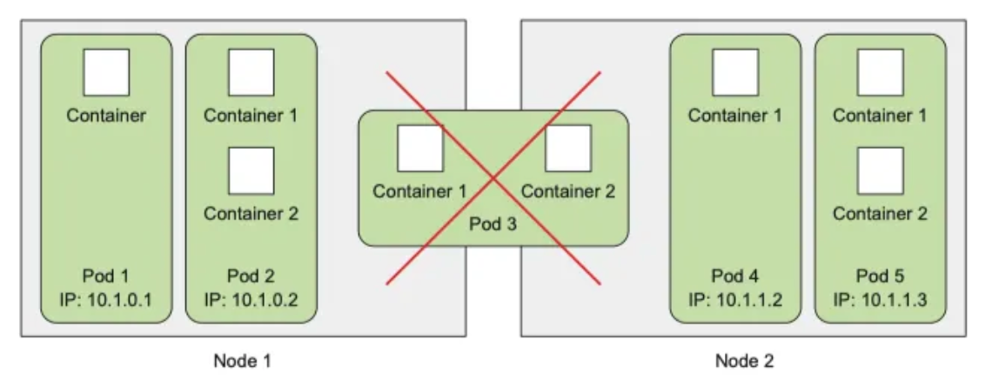
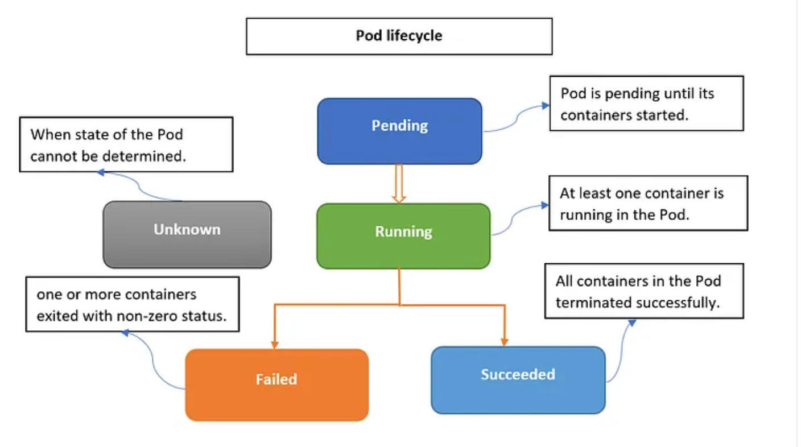

# k8s 

## 쿠버네티스의 등장 배경 및 목적

- 컨테이너의 등장으로 고정된 환경을 반복 배포하기 쉬워짐
- 대규모 운영에는 스케줄링, 장애 복구, 확장 자동화가 필요
- **Kubernetes**는 이를 자동화하는 오케스트레이션 시스템

## 쿠버네티스 주요 구성요소 개요

- **Cluster**: 쿠버네티스 전체 환경 단위
- **Node**: 실제 컨테이너가 실행되는 워커 머신
- **Pod**: 하나 이상의 컨테이너 실행 단위
- **Control Plane**
  - **API Server**: 명령 요청의 중심
  - **Scheduler**: Pod 배치 결정
  - **Controller Manager**: 상태 유지
  - **etcd**: 클러스터 상태 저장소

## Pod-to-Pod, NodePort, ClusterIP

- **Pod-to-Pod 통신**: 클러스터 내부 IP를 통해 직접 통신
- **Pod**는 고유 IP를 하나씩 할당받음
- **Service (ClusterIP)**: 내부 서비스 접근용 가상 IP 제공
- **Service (NodePort)**: 외부에서 접근 가능한 고정 포트 노출

## Pod vs Service

- **Pod = 실행 단위(프로세스/컨테이너가 돌아가는 자리), 직원(일하는 사람)**
- **Service = 접속 단위(안정적으로 붙게 해주는 고정 접점), 대표번호(콜센터 번호)**

### Pod란?

**Pod는 쿠버네티스가 스케줄링하는 최소 배포 단위**입니다.

- 보통 **컨테이너 1개(또는 밀접한 2~3개)**를 담음
- 같은 Pod 안 컨테이너들은
  - **IP/포트 네임스페이스 공유** (localhost로 통신 가능)
  - **볼륨 공유** 가능
- Pod는 본질적으로 **휘발성**
  - 재시작/재스케줄링되면 **Pod IP가 바뀔 수 있음**
  - ReplicaSet/Deployment는 Pod 개수 유지를 보장하지만 Pod 자체는 교체될 수 있음

즉, Pod는 "서버 인스턴스" 같은 느낌이며 **주소(IP)가 고정이 아니다**가 핵심입니다.

### Service란?

- Service는 Pod 집합에 대한 "고정된 접속 창구(Stable Endpoint)"
- 라벨 셀렉터로 **어떤 Pod들이 이 서비스 뒤에 붙을지** 정의
- 제공 기능
  - **고정된 ClusterIP(DNS 이름 포함)**
  - **로드밸런싱** (여러 Pod로 트래픽 분산)
  - **Pod IP가 바뀌어도** Service는 그대로

즉, Service는 "이 앱에 접속하는 대표 주소"입니다.

### 왜 둘 다 필요해?

- Deployment가 `my-app` Pod를 3개 띄운다고 가정
- 각 Pod는 IP가 다르고, 재생성되면 IP가 바뀜
- 클라이언트가 매번 Pod IP를 알아야 하면 운영이 불가능

따라서:

- 클라이언트는 **Service(my-app-svc)** 로 접속
- Service가 **현재 살아있는 Pod들**로 자동 분배

## 자원관리 기초

### Pod 생성 및 확인



- Pod는 컨테이너 실행의 최소 단위
- 매니페스트 파일로 Pod 정의 후 적용

```
kubectl apply -f pod.yaml
kubectl get pods
kubectl describe pod <pod-name>
```

### pod lifecycle


